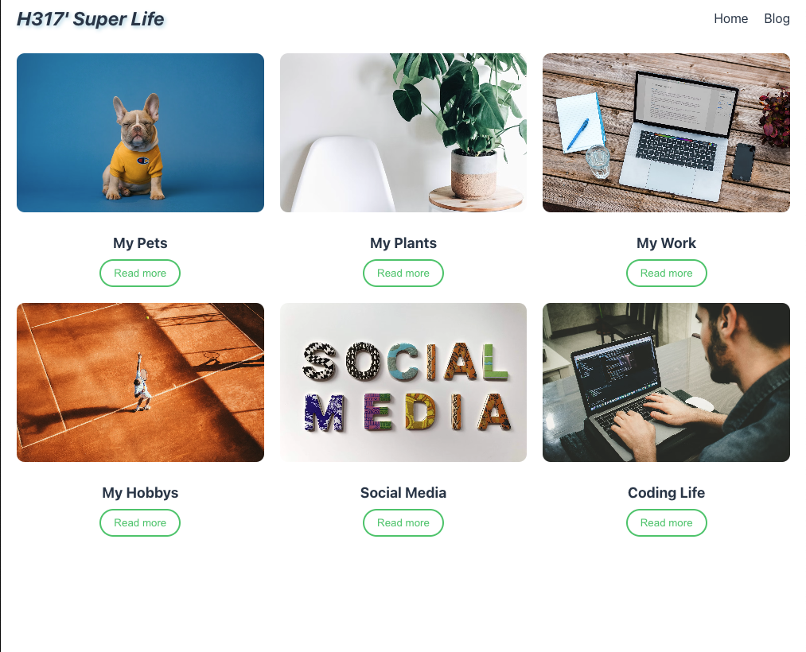

# React&TS Web Blog

React Blog

Overview

React Blog is a modern, responsive web application designed to showcase a blogging platform powered by React. It provides a clean user interface for reading and interacting with blog posts, leveraging React's component-based architecture for a seamless user experience.

Features

Dynamic Blog Posts: Display a collection of blog posts with titles, content, and metadata.

Responsive Design: Optimized for both desktop and mobile devices using CSS and media queries.

Interactive UI: Supports user interactions such as navigating between posts and viewing post details.

Static Site Deployment: Hosted via GitHub Pages for easy access and scalability.

Technologies Used

React: JavaScript library for building user interfaces.

JavaScript (ES6+): For application logic and interactivity.

HTML5 & CSS3: For structure and styling, including responsive layouts.

GitHub Pages: For hosting the static site demo.

Vite (or Create React App): For project setup and development environment (assumed based on common React practices).
